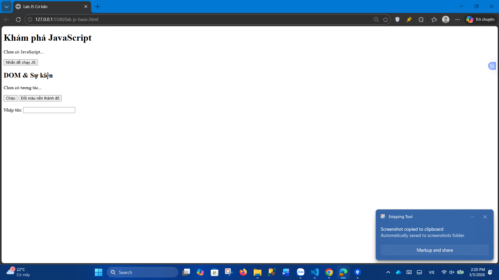
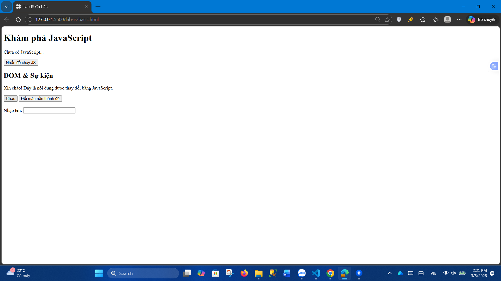
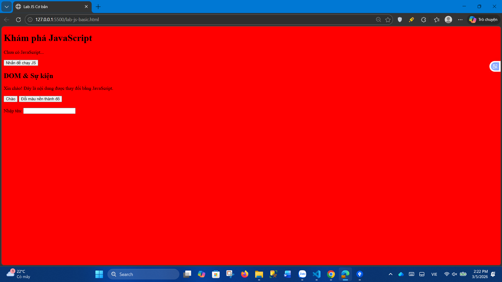
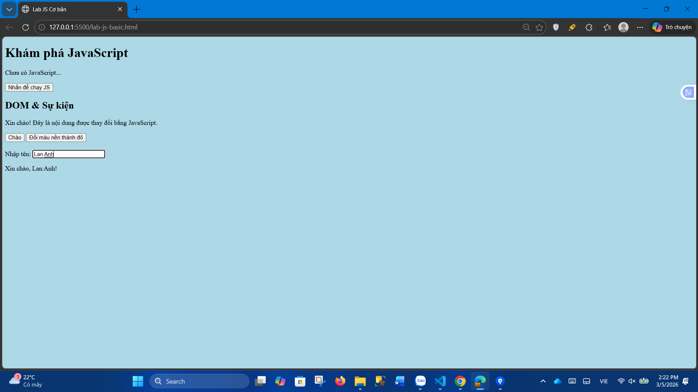

## BTTH03: JS nền tảng, DOM & Sự kiện

**Đối tượng:** Sinh viên chưa học lý thuyết JavaScript

---

## 1. MỤC TIÊU HỌC TẬP

Sau buổi lab, sinh viên có thể:

- Mô tả được JavaScript là gì, chạy ở đâu, khác HTML/CSS ở điểm nào.
- Viết được các đoạn JS đơn giản với:
  - Biến, kiểu dữ liệu cơ bản (number, string, boolean),
  - Cú pháp lệnh, toán tử đơn giản,
  - Cấu trúc điều khiển if/else, vòng lặp đơn giản,
  - Hàm (function) có tham số và giá trị trả về.
- Thao tác được với DOM:
  - Lấy phần tử bằng `document.getElementById`,
  - Thay đổi nội dung văn bản, kiểu dáng (style),
  - Lắng nghe và xử lý một số sự kiện cơ bản: `click`, `input`.
- Nhận biết jQuery là một thư viện hỗ trợ thao tác DOM/sự kiện (ở mức nhận diện, chưa cần sử dụng thành thạo).

---

## 2. CẤU TRÚC THỜI GIAN BUỔI LAB
- 03 tiết thực hành.

---

## 3. HOẠT ĐỘNG 1 (45’): GIỚI THIỆU JS & CÚ PHÁP CƠ BẢN

### 3.1. Chuẩn bị file HTML & JS

Tạo file `lab-js-basic.html`:

```html
<!DOCTYPE html>
<html lang="vi">
<head>
  <meta charset="UTF-8">
  <title>Lab JS Cơ bản</title>
</head>
<body>
  <h1>Khám phá JavaScript</h1>
  <p id="welcome">Chưa có JavaScript...</p>
  <button id="runBtn">Nhấn để chạy JS</button>

  <script src="main.js"></script>
</body>
</html>
```

Tạo file `main.js`:

```js
console.log("Hello from JavaScript!");
```


---

### 3.2. Nhiệm vụ cho sinh viên

#### Bước 1: Mở file \& Quan sát bằng Console

1. Mở `lab-js-basic.html` trong trình duyệt (Chrome/Edge/…).
2. Mở DevTools → tab **Console**.
3. Quan sát thông báo xuất hiện.

> Câu hỏi:
> - Em thấy dòng thông báo nào trong console?
Hello from JavaScript!
Live reload enabled.

> - Điều này cho em biết JavaScript đang làm gì khi trang web được tải?
Điều này cho thấy file JavaScript đã được tải và thực thi khi trang web mở, và lệnh console.log() trong JavaScript đã in thông báo ra Console để kiểm tra chương trình.
Ngoài ra, dòng “Live reload enabled.” cho biết trang đang chạy bằng Live Server, nên khi lưu file thì trang sẽ tự động tải lại.
---

#### Bước 2:  “JavaScript là gì?” (Tra cứu nhanh)

Sử dụng 1–2 nguồn tài liệu (vd. W3Schools, freeCodeCamp, …), tóm tắt:

> a) JavaScript chạy ở đâu? (Trình duyệt / Server / Cả hai?)
JavaScript có thể chạy cả trên trình duyệt và trên server.

> b) HTML, CSS, JavaScript mỗi phần chịu trách nhiệm chính về điều gì?
>
> - HTML: tạo cấu trúc và nội dung của trang web (tiêu đề, đoạn văn, hình ảnh, link, form…)
> - CSS: dùng để định dạng giao diện cho trang web (màu sắc, font chữ, bố cục, khoảng cách…).
> - JavaScript: dùng để tạo tương tác và chức năng động cho trang web (xử lý sự kiện, kiểm tra form, thay đổi nội dung trang…).
---

#### Bước 3: Thử nghiệm biến \& kiểu dữ liệu trong Console

Trong tab Console, gõ từng dòng sau và ghi lại kết quả:

```js
let age = 20;
const name = "An";
let isStudent = true;

typeof age;
typeof name;
typeof isStudent;

1 + 2 * 3;
"Hello " + "world";
```

> Câu hỏi:
> - Kết quả `typeof age` là gì?  'number'
> - Kết quả `typeof name` là gì? 'string'
> - Kết quả `typeof isStudent` là gì? 'boolean'
> - Em hãy tự mô tả ngắn gọn:
>   - `number` là: kiểu dữ liệu dùng để lưu số (ví dụ: 10, 20, 3.14…).
>   - `string` là: kiểu dữ liệu dùng để lưu chuỗi ký tự / văn bản, đặt trong dấu " " hoặc ' '.
>   - `boolean` là: kiểu dữ liệu chỉ có 2 giá trị đúng hoặc sai

---

#### Bước 4: Viết đoạn script tính tuổi

Mở file `main.js`, viết thêm:

```js
let name = "An";
let yearOfBirth = 2005;
let currentYear = 2026;
let age = currentYear - yearOfBirth;

console.log("Xin chào, mình là " + name + ", năm nay mình " + age + " tuổi.");
```

Sau đó:

1. Đổi giá trị `name`, `yearOfBirth` thành thông tin của chính em.
2. Reload trang \& quan sát console.

> Câu hỏi:
> - Dòng log hiển thị gì sau khi em sửa thông tin?
Sau khi sửa name và yearOfBirth thành thông tin của mình và reload trang, Console sẽ hiển thị câu chào với tên và tuổi đã tính.
Xin chào, mình là Lan Anh, năm nay mình 22 tuổi.

> - Nếu em quên dấu `;` hoặc quên dấu `+`, điều gì xảy ra? Trình duyệt báo lỗi thế nào?
Quên ; → thường vẫn chạy.
Quên + → báo lỗi SyntaxError trong Console và code không chạy.
---

#### Bước 5: Phản tư nhanh (Reflection)

> - Điều thú vị nhất em vừa khám phá được về console là gì?
Điều thú vị nhất là Console có thể chạy và kiểm tra code JavaScript trực tiếp, giúp xem kết quả ngay lập tức mà không cần sửa file nhiều lần. Console cũng giúp in thông tin bằng console.log() để kiểm tra chương trình có chạy đúng hay không.

> - Em gặp lỗi cú pháp nào? Em đã xử lý bằng cách nào (tự sửa, hỏi bạn, đọc lỗi, tìm Google, …)?
Em gặp lỗi thiếu dấu + khi nối chuỗi với biến, khiến Console báo lỗi SyntaxError.
Em đã đọc thông báo lỗi trong Console, kiểm tra lại dòng code và thêm dấu + đúng vị trí để chương trình chạy lại bình thường.
---

## 4. HOẠT ĐỘNG 2 (40’): CẤU TRÚC ĐIỀU KHIỂN \& HÀM

### 4.1. Chuẩn bị file logic (hoặc viết tiếp trong main.js)

Ví dụ đoạn mã:

```js
// TODO: Đổi giá trị score và quan sát kết quả
let score = 7.5;

// TODO: Dự đoán điều kiện if/else đang làm gì, rồi chạy thử
if (score >= 8) {
  console.log("Giỏi");
} else if (score >= 6.5) {
  console.log("Khá");
} else if (score >= 5) {
  console.log("Trung bình");
} else {
  console.log("Yếu");
}

// TODO: Viết hàm tính điểm trung bình 3 môn
function tinhDiemTrungBinh(m1, m2, m3) {
  let avg = (m1 + m2 + m3) / 3;
  return avg;
}

// Gợi ý dùng thử hàm trong console:
// tinhDiemTrungBinh(8, 7, 9);
```


---

### 4.2. Nhiệm vụ cho sinh viên

#### Bước 1: Đoán trước – chạy sau

> a) Nếu `score = 9`, em dự đoán console sẽ in: Giỏi
> b) Nếu `score = 6`, em dự đoán console sẽ in: Trung bình

Sau đó:

1. Thay `score = 9`, reload trang hoặc chạy file và kiểm tra console.
2. Thay `score = 6`, kiểm tra lại.

> So sánh dự đoán và kết quả thực tế:
> - Trường hợp `score = 9`: Dự đoán vs Thực tế: Dự đoán Giỏi – Thực tế Giỏi
> - Trường hợp `score = 6`: Dự đoán vs Thực tế: Dự đoán Trung bình – Thực tế Trung bình
---

#### Bước 2: Mô tả lại if/else bằng lời

> - Khi nào chương trình in `"Giỏi"`?
Khi score >= 8.

> - Khi nào chương trình in `"Yếu"`?
Khi score < 5 (không thỏa bất kỳ điều kiện nào ở trên).

> - Em hãy mô tả cấu trúc `if/else` bằng lời của em (có thể ví von “ngã rẽ” trong đời sống):

Chương trình giống như đi qua các “cửa kiểm tra” theo thứ tự.
Nếu điểm >= 8 thì rẽ vào nhánh Giỏi và dừng. Nếu không, kiểm tra tiếp >= 6.5 thì rẽ vào Khá. Nếu vẫn không, kiểm tra >= 5 thì vào Trung bình. Còn lại (dưới 5) thì vào Yếu.

---

#### Bước 3: Làm việc với hàm

1. Mở Console, gọi hàm:
```js
tinhDiemTrungBinh(8, 7, 9);
```

> Em ghi lại giá trị hàm trả về: 8

2. Viết thêm hàm `xepLoai(avg)` trong file JS:
```js
function xepLoai(avg) {
  // TODO: Dùng if/else để:
  // avg >= 8  -> "Giỏi"
  // avg >= 6.5 -> "Khá"
  // avg >= 5  -> "Trung bình"
  // còn lại   -> "Yếu"
}
```

3. Gọi thử trong console:
```js
let avg = tinhDiemTrungBinh(8, 7, 9);
let loai = xepLoai(avg);
console.log("Điểm TB:", avg, " - Xếp loại:", loai);
```

> Câu hỏi:
> - Một hàm gồm những phần chính nào?
>   - Tên hàm: tinhDiemTrungBinh (hoặc xepLoai)
>   - Tham số (parameters): m1, m2, m3 (hoặc avg)
>   - Thân hàm (body): phần code nằm trong { ... } để xử lý tính toán/điều kiện
>   - Giá trị trả về (return): avg (hoặc "Giỏi" / "Khá" / "Trung bình" / "Yếu")
> - Ưu điểm của việc dùng hàm thay vì lặp lại cùng một đoạn code nhiều lần là gì?
Tái sử dụng: gọi lại nhiều lần với dữ liệu khác nhau

Dễ sửa: sửa 1 chỗ, chỗ khác tự đúng theo

Code gọn và dễ đọc: rõ ràng chức năng, ít bị rối

Giảm lỗi: tránh copy-paste sai
---

#### Bước 4: Mở rộng nhỏ (tuỳ chọn)

Viết hàm `kiemTraTuoi(age)`:

```js
function kiemTraTuoi(age) {
  // TODO:
  // Nếu age >= 18 -> console.log("Đủ 18 tuổi");
  // Ngược lại -> console.log("Chưa đủ 18 tuổi");
}
```

Gọi thử: `kiemTraTuoi(16);`, `kiemTraTuoi(20);`.

---

#### Bước 5: Phản tư

> - Phần nào trong if/else hoặc hàm khiến em khó hiểu nhất?
Phần khiến em khó hiểu nhất là thứ tự kiểm tra điều kiện trong if/else if. Ban đầu em chưa hiểu vì sao phải kiểm tra từ điều kiện điểm cao xuống thấp, và nếu một điều kiện đúng thì các điều kiện phía sau sẽ không được kiểm tra nữa. 

> - Em đã làm gì để vượt qua (thử nhiều lần, hỏi bạn, xem lại ví dụ, tra Google, …)?
Em đã thử thay đổi nhiều giá trị score khác nhau và chạy lại chương trình để quan sát kết quả trong Console. Ngoài ra em xem lại ví dụ trong bài và đọc thông báo trong Console để hiểu cách chương trình hoạt động. Sau khi thử nhiều lần, em hiểu rằng if/else hoạt động giống như các ngã rẽ kiểm tra điều kiện theo thứ tự.
---

## 5. HOẠT ĐỘNG 3 (40’): THAO TÁC DOM \& SỰ KIỆN

### 5.1. Chuẩn bị HTML

Thêm vào trang (hoặc tạo file mới):

```html
<section>
  <h2>DOM & Sự kiện</h2>
  <p id="status">Chưa có tương tác...</p>

  <button id="btnHello">Chào</button>
  <button id="btnRed">Đổi màu nền thành đỏ</button>

  <div style="margin-top: 20px;">
    <label>Nhập tên: </label>
    <input id="nameInput" type="text" />
    <p id="greeting"></p>
  </div>
</section>

<script src="dom.js"></script>
```

Tạo file `dom.js`:

```js
const statusEl = document.getElementById("status");
const btnHello = document.getElementById("btnHello");

btnHello.addEventListener("click", function () {
  statusEl.textContent = "Xin chào! Đây là nội dung được thay đổi bằng JavaScript.";
});
```


---

### 5.2. Nhiệm vụ cho sinh viên

#### Bước 1: Đọc \& giải thích

> Câu hỏi:
> - `document.getElementById("status")` đang làm gì?
Nó tìm và lấy ra phần tử HTML có id="status" trên trang (ở đây là thẻ <p id="status">...), rồi gán vào biến statusEl để JavaScript có thể thay đổi nội dung/thuộc tính của nó.

> - Sự kiện `"click"` xảy ra khi nào?
Xảy ra khi người dùng nhấn chuột vào phần tử (nút button). Khi bấm vào nút, sự kiện click được kích hoạt và chạy đoạn code trong addEventListener.

> - Trong đoạn code trên, khi nhấn nút `btnHello`, điều gì thay đổi trên trang?
Nội dung của <p id="status">...</p> sẽ đổi từ:
“Chưa có tương tác...”
thành:
“Xin chào! Đây là nội dung được thay đổi bằng JavaScript.”
(vì statusEl.textContent = ... đã cập nhật chữ.)
---

#### Bước 2: Thử nghiệm nút đổi màu nền

Hoàn thiện code:

```js
const btnRed = document.getElementById("btnRed");

btnRed.addEventListener("click", function () {
  // TODO: Đổi màu nền trang thành đỏ
  document.body.style.backgroundColor = "red";
});
```

> Câu hỏi:
> - Em có thể đổi sang màu khác (vd. `lightblue`) không? Hãy thử.
Có. Chỉ cần thay "red" bằng "lightblue":

> - Em hãy ghi lại 1 ví dụ khác mà JavaScript có thể làm với `document.body.style`.
Ví dụ đổi màu chữ toàn trang: document.body.style.color = "white";


---

#### Bước 3: Xử lý sự kiện input – gõ tên, hiện lời chào

Hoàn thiện code:

```js
const nameInput = document.getElementById("nameInput");
const greeting = document.getElementById("greeting");

nameInput.addEventListener("input", function () {
  const value = nameInput.value;
  greeting.textContent = "Xin chào, " + value + "!";
});
```

> Câu hỏi:
> - Sự kiện `"input"` khác gì so với `"click"`?
"click": chỉ chạy khi bấm vào nút/phần tử.

"input": chạy mỗi lần nội dung trong ô input thay đổi (gõ thêm, xoá, dán chữ…).

> - Khi em xoá hết nội dung ô input, dòng `greeting` hiển thị gì?
Khi xoá hết, value = "" (chuỗi rỗng) nên greeting sẽ hiển thị:
“Xin chào, !”
---

#### Bước 4: Liên hệ khái niệm DOM

> DOM (Document Object Model) là mô hình biểu diễn trang HTML dưới dạng một **cây các đối tượng** mà JavaScript có thể truy cập và thay đổi.
>
> Em hãy:
> - Tự mô tả DOM bằng lời của em:
>   DOM là bản mô hình của trang HTML dưới dạng các đối tượng (cây), giúp JavaScript có thể tìm, đọc và thay đổi nội dung/giao diện của trang (đổi chữ, đổi màu, thêm/xoá phần tử…).

> - Nêu 1 ví dụ “thao tác DOM” trong bài (ghi lại 1 dòng lệnh cụ thể).
statusEl.textContent = "Xin chào! Đây là nội dung được thay đổi bằng JavaScript.";
Hoặc:
document.body.style.backgroundColor = "red";
---

#### Bước 5: Ảnh kết quả

Hãy chụp các ảnh màn hình:

1. Khi vừa tải trang (chưa tương tác).

2. Sau khi nhấn “Chào”.

3. Sau khi đổi nền sang màu đỏ.

4. Khi gõ tên và nhìn thấy lời chào xuất hiện.

*(Ảnh có thể được yêu cầu nộp cùng bài hoặc dán vào báo cáo)*

---

## 6. KẾT THÚC (15’): GIỚI THIỆU JQUERY \& PHẢN TƯ

### 6.1. Nhìn nhanh jQuery (so sánh với JS thuần)

Ví dụ:

```js
// JS thuần
document.getElementById("btnHello").addEventListener("click", function () {
  alert("Hello from JS!");
});

// jQuery (giả sử đã import jQuery)
$("#btnHello").on("click", function () {
  alert("Hello from jQuery!");
});
```

> Câu hỏi:
> - Điểm giống nhau về chức năng giữa 2 đoạn code trên là gì?
Cả hai đoạn code đều bắt sự kiện click của nút btnHello và khi nhấn vào nút thì hiển thị thông báo alert trên màn hình.

> - Điểm khác nhau về cú pháp là gì (`document.getElementById` vs `$("#id")`, `addEventListener` vs `.on`)?
JavaScript thuần: dùng document.getElementById("btnHello") để lấy phần tử và dùng addEventListener() để gắn sự kiện.

jQuery: dùng cú pháp ngắn gọn hơn $("#btnHello") để chọn phần tử và dùng .on() để gắn sự kiện. 
> - Em hãy tra cứu nhanh “What is jQuery used for?” và ghi 2 ý chính:
>   1. jQuery được dùng để đơn giản hóa việc thao tác DOM và xử lý sự kiện trong JavaScript.
>   2. jQuery giúp viết code ngắn gọn hơn và hỗ trợ hiệu ứng, AJAX, tương thích nhiều trình duyệt.

---

### 6.2. Tự đánh giá \& định hướng

> 1. Sau buổi lab, em tò mò nhất về phần nào của JavaScript/DOM?
Em tò mò nhất về DOM và sự kiện, vì JavaScript có thể thay đổi nội dung, màu sắc và tạo tương tác trực tiếp với người dùng trên trang web.

> 2. Em muốn tự làm thêm tính năng gì trên trang web (vd: bộ đếm, đổi theme, pop-up, mini game, …)?
Em muốn thử làm nút đổi theme sáng/tối (dark mode) hoặc bộ đếm số lần click của người dùng để trang web có thêm tương tác.

> 3. Em đánh giá mức độ hiểu của mình về:
Biến & kiểu dữ liệu: [ ] Chưa hiểu [x] Tạm ổn [ ] Khá rõ

If/else & hàm: [ ] Chưa hiểu [x] Tạm ổn [ ] Khá rõ

DOM & sự kiện: [ ] Chưa hiểu [x] Tạm ổn [ ] Khá rõ

---

## 7. GHI CHÚ CHO GIẢNG VIÊN (NỘI BỘ)

- Có thể cho SV làm theo cặp/nhóm 2–3 để hỗ trợ nhau thử nghiệm, đọc lỗi, tra cứu.
- Tùy thời lượng thực tế, có thể:
    - Giảm bớt phần mở rộng (hàm `kiemTraTuoi`, tuỳ biến thêm hiệu ứng).
    - Hoặc tăng thêm bài tập DOM (ẩn/hiện một khối, đếm số lần click, v.v.).
- Phiếu học tập tiếp theo có thể chi tiết hóa từng hoạt động thành form trả lời, chỗ dán ảnh, và câu hỏi mini test trắc nghiệm.

```

---```

